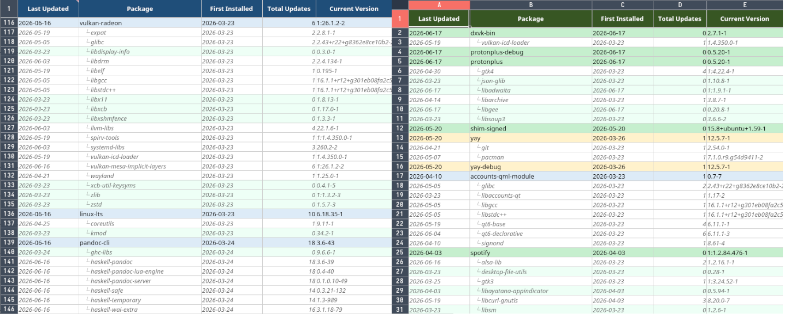

# pkglog
A package history tracker for Arch Linux. Parses `/var/log/pacman.log` and generates a formatted `.xlsx` spreadsheet with a full record of every package ever installed, updated, or removed on your system — broken out by source.
Useful for auditing your system after security incidents like the [June 2026 AUR supply-chain attack](https://www.privacyguides.org/news/2026/06/12/around-1-500-aur-packages-compromised-with-rootkit-like-malware/).
---
## Preview



## Sheets
| Sheet | Contents |
|---|---|
| **Explicitly Downloaded** | Packages you manually installed via `pacman -S` from official repos |
| **AUR** | AUR and manually installed packages |
| **Official Dependencies** | Auto-installed dependencies from official repos |
| **History** | Every pacman event ever, color-coded by action |

### All sheet columns
| Column | Description |
|---|---|
| Date | Date of the event |
| Time | Time of the event |
| Action | `installed` / `upgraded` / `reinstalled` / `removed` |
| Package | Package name |
| Version / Change | Version string, or `old -> new` for upgrades |

Rows are color-coded by action:
- 🟢 Green — installed
- 🔵 Blue — upgraded
- 🟡 Yellow — reinstalled
- 🔴 Red — removed
---
## Requirements
- Arch Linux (requires `pacman`)
- Python 3.8+
- `python-openpyxl`
```bash
sudo pacman -S python-openpyxl
```
To open the generated spreadsheet:
```bash
sudo pacman -S libreoffice-fresh
```
---
## Installation
```bash
git clone https://github.com/YOUR_USERNAME/pkglog ~/pkglog
cd ~/pkglog
python3 logscript.py --setup
```
`--setup` will:
1. Check that dependencies are present
2. Install a pacman hook to `/etc/pacman.d/hooks/pkglog.hook` (prompts for sudo)
3. Generate the initial spreadsheet from your full pacman log history
---
## Usage
```bash
# First-time setup (installs hook + generates spreadsheet)
python3 ~/pkglog/logscript.py --setup

# Generate or refresh the spreadsheet manually
python3 ~/pkglog/logscript.py
```
Once set up, the spreadsheet regenerates automatically after every `pacman` transaction — installs, upgrades, and removals.
The output file is written to the same directory as the script:
```
~/pkglog/pkglog.xlsx
```

---
## How it works
pacman writes a timestamped log of every transaction to `/var/log/pacman.log`. pkglog parses that log and classifies packages using two queries:
- **Official vs AUR** — checked against `pacman -Slq` (all packages in the sync databases). Packages not found there are classified as AUR or manually installed.
- **Explicit vs dependency** — checked against `pacman -Qqe` (explicitly installed packages). Official packages not in this list are auto-installed dependencies.

The pacman hook (`pkglog.hook`) triggers after every transaction and reruns the script, so the spreadsheet is always up to date.
---
## Caveats
- **Source detection is current-state only.** If a package was in the official repos when you installed it but has since been removed from them, it may be misclassified as AUR. This is a limitation of `pacman -Slq`.
- **Explicit detection is current-state only.** If you explicitly installed a package and have since removed it, it won't appear in `pacman -Qqe` and will be treated as a dependency.
- **Log rotation.** If your pacman log has been rotated or truncated, history before that point won't appear. The default Arch setup does not rotate `/var/log/pacman.log` automatically, so this is usually not an issue.
- **The hook runs as root** (all pacman hooks do), writing the xlsx to the script's directory. Make sure the script lives somewhere writable by root, or adjust the output path in `logscript.py`.
---
## License
MIT
